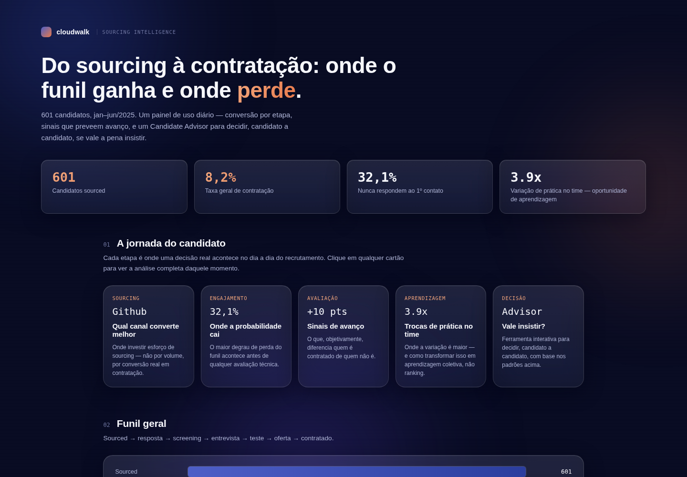

# CloudWalk — Sourcing Funnel Analysis

Case técnico para a vaga de Atração e Seleção. Análise do funil de sourcing (601 candidatos,
jan–jun/2025), com uso aplicado de IA para classificar o sinal qualitativo das notas de recrutador.



> Screenshot atualizado após a versão final do dashboard. As únicas diferenças possíveis num navegador
> comum são de tipografia (Sora/Inter via Google Fonts) — os gráficos são SVG nativo, sem dependência
> externa, e renderizam do mesmo jeito com ou sem internet.

## O que este repositório responde

- Quais estratégias de sourcing convertem melhor?
- Quais sinais indicam maior chance de avanço?
- Quando vale a pena insistir com um(a) candidato(a)?
- Quando a probabilidade de conversão é baixa?
- Há padrões relevantes entre canais, recrutadores e perfis?

## Estrutura

```
├── data/
│   ├── mock_sourcing_dataset.xlsx      # dataset original
│   └── mock_sourcing_dataset.csv       # mesmo dataset em CSV
├── notebooks/
│   ├── sourcing_funnel_analysis.ipynb  # análise completa, com gráficos
│   ├── analysis.py                     # lógica de análise (fonte do notebook)
│   ├── make_charts.py                  # geração dos gráficos
│   ├── ai_note_classifier.py           # classificador de notas via Claude API (pronto p/ produção)
│   └── build_notebook.py / build_pdf.py
├── dashboard/
│   └── index.html                      # dashboard interativo (abrir direto no navegador)
├── docs/
│   └── Relatorio_Tecnico.pdf           # abordagem, decisões, uso de IA, insights
├── outputs/
│   ├── charts/                         # PNGs usados no notebook e no PDF
│   └── ai_notes_classification.csv     # output cacheado da classificação de IA
└── requirements.txt
```

## Candidate Advisor

O dashboard tem uma ferramenta interativa para decidir, candidato a candidato, se vale a pena insistir:

- **Motor determinístico (sempre ativo, sem chave, funciona offline):** você preenche canal, recrutador,
  senioridade, os 3 scores, tempo de resposta e sinal da nota; o motor calcula um índice de 0–10 com peso
  explícito por fator (scores objetivos e velocidade pesam mais que canal/recrutador, e a nota qualitativa
  tem peso zero no índice — só é exibida como contexto, porque a seção 6 mostra que ela não prediz bem
  contratação). Cada ponto do índice vem com a justificativa numérica ao lado. O botão de avaliar só
  habilita quando todos os campos numéricos estão preenchidos com valores válidos.
- **Chat opcional com IA real:** ao adicionar sua própria chave da API Anthropic (fica só na memória da
  aba, nunca salva ou commitada), você pode perguntar em linguagem natural sobre um candidato — a resposta
  usa os mesmos dados agregados do dashboard como contexto, não números inventados.

Os gráficos são construídos em SVG puro (sem biblioteca externa) justamente para não depender de CDN —
funcionam identicamente com ou sem internet, com ou sem bloqueador de anúncios.

## Design e apresentação de dados

- **Identidade visual alinhada à marca CloudWalk** — navy/indigo profundo, painéis em liquid glass,
  tipografia geométrica (Sora/Inter/IBM Plex Mono) e o formato de KPI empilhado (número + label) do
  material institucional da empresa.
- **Um tipo de gráfico por tipo de pergunta** — funil customizado, barra horizontal (canal), radar (perfil
  de score contratado vs. não contratado), doughnut (composição do sinal de IA) e barra empilhada de 3
  faixas (panorama do pipeline), em vez de repetir o mesmo gráfico de barras em tudo.
- **Dados de recrutador sem ranking** — a seção "Aprendizagem entre pares" mostra a mesma variação que um
  ranking mostraria, mas em ordem alfabética e com uma cor só, porque o objetivo é abrir espaço pra
  comunidade de prática e shadowing, não pra avaliação pública de desempenho individual. O racional
  completo está documentado dentro do próprio dashboard, na seção "Escolhas deliberadas".

## Como rodar

```bash
pip install -r requirements.txt
jupyter notebook notebooks/sourcing_funnel_analysis.ipynb
```

O dashboard não precisa de servidor — é um único arquivo HTML com os dados embutidos:

```bash
open dashboard/index.html   # ou clique duas vezes no arquivo
```

## Uso de IA neste projeto

O uso de IA está documentado em detalhe no `docs/Relatorio_Tecnico.pdf` (seção 3), mas resumindo:

1. **Classificação estruturada de texto** — o campo `recruiter_notes` (11 templates distintos entre
   601 candidatos) foi classificado pelo Claude (Anthropic) em tema e sinal (positivo/risco/misto),
   simulando um classificador de *automated candidate feedback* em produção. Código real e pronto
   para API em `notebooks/ai_note_classifier.py`; resultado cacheado em
   `outputs/ai_notes_classification.csv`.
2. **Apoio na construção da análise** — geração assistida do código de exploração, gráficos e do
   dashboard, com lógica de negócio, cortes analíticos e interpretação dos resultados definidos e
   revisados manualmente.

O achado mais relevante da camada de IA foi negativo: a nota qualitativa do recrutador, do jeito que
é registrada hoje, **não prediz bem contratação** — ver seção 6 do notebook.

## Principais insights

| # | Insight |
|---|---------|
| 1 | 32% dos candidatos sourced nunca respondem ao 1º contato — maior perda do funil |
| 2 | Conversão varia mais entre recrutadores (3,9x) do que entre canais (2,3x) — sinal de aprendizagem, não de ranking |
| 3 | Os três scores (técnico, comportamental, gestor) diferenciam contratados — não só o técnico |
| 4 | Contratados passam ~3,5x mais tempo no funil (32 vs. 9 dias) |
| 5 | Sinal qualitativo classificado por IA tem baixo poder preditivo sobre contratação |

Algumas comparações usam amostras pequenas (ex.: um tema de nota com 1 candidato só) — tratadas como
direção, não como certeza estatística. Detalhes e recomendações práticas completas em
`docs/Relatorio_Tecnico.pdf`.
